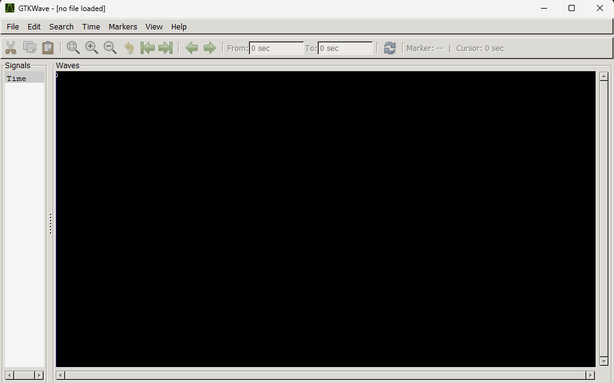
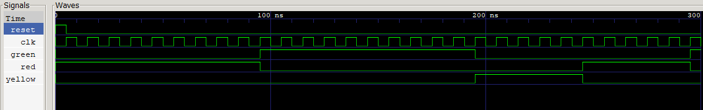

# Traffic Light Controller (Verilog)

This project simulates a **basic traffic light controller** using Verilog HDL. It includes both the main controller logic and a testbench to simulate and verify its behavior.

---

## Core Logic
### 1. `traffic_light.v`
This is the **main Verilog module** that controls the traffic light.

- Uses a **finite state machine (FSM)** with three states:
  - `GREEN`
  - `YELLOW`
  - `RED`
- Lights change based on a **timer and state transitions**.
- Timing (in terms of clock cycles):
  - **GREEN**: 10 cycles
  - **YELLOW**: 5 cycles
  - **RED**: 10 cycles
- Responds to a `reset` signal by returning to the `RED` state and resetting the timer.
---

## How It Works

1. **At reset**, the system initializes to the `RED` state.
2. The **timer** counts the number of clock cycles spent in each state.
3. Once a state's time expires, the FSM moves to the **next state**:
   - `RED → GREEN → YELLOW → RED → ...`
4. Based on the state, the corresponding output signal is activated:
   - Only one light (`red`, `yellow`, or `green`) is high (`1`) at a time.

---

## Running the Simulation
First make sure you have MSYS2 & Icarus Verilog installed and set-up. If not, watch [this](https://youtu.be/08S6NxUs-Uo?si=qZ0mZw2i-GhT4kU-).

With MSYS2 installed, go to the Windows Search Bar and look for MSYS2MinGW64. A command-based interface will open. The first step is always updating the package databases using pacman package manager. Use this command:
```bash
$ pacman -Syu
```

We also need to install __GTK Wave__ for the Signal Waveforms. For that, we will use this command:
```bash
$ pacman -S mingw-w64-x86_64-gtkwave
```


To verify the installation of GTKWave, run the following command:
```bash
$ gtkwave
```
If it is, an window should open like this:



Now we are all set-up, let's move on with the code. In your PC, go to your directory of choice and clone this repo by running the following code:
```bash
$ gh repo clone surajit-13-sutradhar/Traffic-Light-Controller
```

Delete all the files except trafficLight.v and trafficLightTB.v. We'll be building them again.


Open __MSYS2MinGW64__ from Windows Search Bar and go to your project folder using a command that will look something like:
```bash
cd "D:/Traffic Light"
```
Or, if you are using VSCode, you can directly run this from the terminal.


Now run the following:
```bash
$ iverilog -o traffic_light.vvp trafficLight.v
```

(Here **-o** means the output file and we specified the name of the output file as `traffic_light.vvp`. The name is preferably same as of the original source file i.e. `traffic_light` and the extension is `.vvp` which is an intermediate file containing the compiled simulation code. Then we specify the source file which we are compiling i.e. `traffic_light.v`)

- The above command should not generate any error which means the code has been compiled correctly.
- If you go to the folder, you should see the output file `traffic_light.vvp` generated there.

To run the `.vvp` file you created in last step use this command on MSYS2 command prompt. This won't display anything.
```bash
$ vvp traffic_light.vvp
```

## Testbench
### 2. `traffic_lightTB.v`
This is the **testbench** that simulates the behavior of the traffic light controller.

- Generates a **clock signal** that toggles every 5 nanoseconds.
- Asserts and then deasserts the **reset** to initialize the system.
- **Monitors and prints** the outputs (`red`, `yellow`, `green`) in the terminal.
- Dumps output to a `.vcd` file for waveform analysis using tools like **GTKWave**.
- Automatically ends the simulation after 200 time units.

## Compiling the Testbench

To compile the testbench file, run the following command.
```bash
$ iverilog -o traffic_light_out.vcd trafficLight.v trafficLightTB.v
```

The extension `.vcd` is **Value Change Dump** file that logs signal value changes over time during a Verilog simulation for waveform analysis and debugging. As the source file, we not only have to specify the `test bench` file but also the `traffic lights module` file.

Now, run the `.vcd` file using the following command:
```bash
$ vvp traffic_light_out.vcd
```
The output should be as follows:


This will also generate a traffic_light.vcd file because of this line in our Testbench.
```bash
$ dumpfile("traffic_light.vcd");  // name of output vcd file
```
## Open the Window in GTKWave
```bash
$ gtkwave traffic_light.vcd
```
**This will launch the GTKWave GUI where we can:**
- Expand signals from the left panel.
- Drag them into the waveform view.
- Zoom in/out and analyze timing transitions.

## The GTKWave Waveform will look like:



